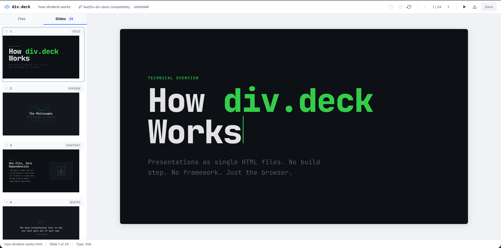

# div.deck

A browser-based slide deck editor for AI-generated HTML presentations.

## The Problem

AI tools are great at generating HTML slide decks from project context — architecture docs, code, meeting notes. Single-file HTML is the perfect format for this: no build step, no dependencies, version-controlled alongside your code. But the output is never quite right. You end up doing round trips back to the LLM: "move this bullet," "swap these slides," "change that heading." Each iteration takes time and often breaks something else.

div.deck gives you the best of both worlds: **fast creation with AI, fine-grained editing by hand**. Generate an HTML deck with the `/new-deck` skill, then open it in the visual editor to drag, click, and type your way to a polished result.



## What You Get

`npx div-deck init` sets up three things in your project:

1. **The `/new-deck` skill** — a Claude Code skill (installed via the plugin marketplace) that generates self-contained HTML slide decks from your project context. It knows six slide types (title, divider, content, split, dashboard, table), four visual aesthetics, and the full CSS/JS contract that makes decks work as both standalone files and editable documents.

2. **The editor** — a React + Express app that runs locally. Slides render in iframes for perfect style isolation. You get click-to-select, inline text editing, drag-to-reorder, undo/redo, presentation mode, and PDF export.

3. **An npm script and slash command** — `npm run deck` and `/decks` in Claude Code both launch the editor and open your browser.

## Quick Start

```bash
npx div-deck init
```

The installer walks you through setup — picking a presentations directory, adding the npm script, and installing the skill. Once done:

```bash
# Create a new deck from your project context
/new-deck

# Launch the editor
npm run deck
```

Or run the editor directly:

```bash
npx div-deck ./presentations     # specify a directory
npx div-deck --port 8080         # custom port (default: 3001)
```

## Features

- **File browser** — list, open, and delete `.html` slide decks
- **Visual editing** — click any element to select it, click again to edit text inline
- **Drag to reorder** — reorder slides in the sidebar or elements within a slide
- **Undo/redo** — full history with Cmd+Z / Cmd+Shift+Z
- **Presentation mode** — full-screen slideshow with keyboard navigation
- **Export PDF** — export via the browser's print dialog (Cmd+P)
- **Git status** — shows current branch and file status in the toolbar

## Keyboard Shortcuts

| Shortcut          | Action                            |
| ----------------- | --------------------------------- |
| Cmd+S             | Save                              |
| Cmd+Z             | Undo                              |
| Cmd+Shift+Z       | Redo                              |
| Cmd+P             | Export PDF                        |
| Left/Right arrows | Navigate slides                   |
| Delete/Backspace  | Delete selected element           |
| Escape            | Deselect / Exit presentation mode |

## How It Works

div.deck runs a single local Express server that serves both the editor UI (React + Vite) and a file API for reading/writing HTML presentations.

Slides render inside iframes for style isolation — your deck's CSS never leaks into the editor and vice versa. An injected bridge script handles all in-slide interaction (hover handles, selection, inline editing, drag-to-reorder) via `postMessage`.

Each presentation is a single self-contained HTML file — no build step, no external dependencies. Open it in any browser to present, or in div.deck to edit.

## Sample Presentations

The `presentations/` directory includes example decks you can explore:

- **how-divdeck-works.html** — a walkthrough of div.deck's architecture and philosophy
- **element-test.html** — a reference deck showing all supported slide types and layouts
- **custom-brand.html** — demonstrates branding integration

Open any of these in the editor to see what's possible, or browse them standalone in your browser.

## License

MIT
