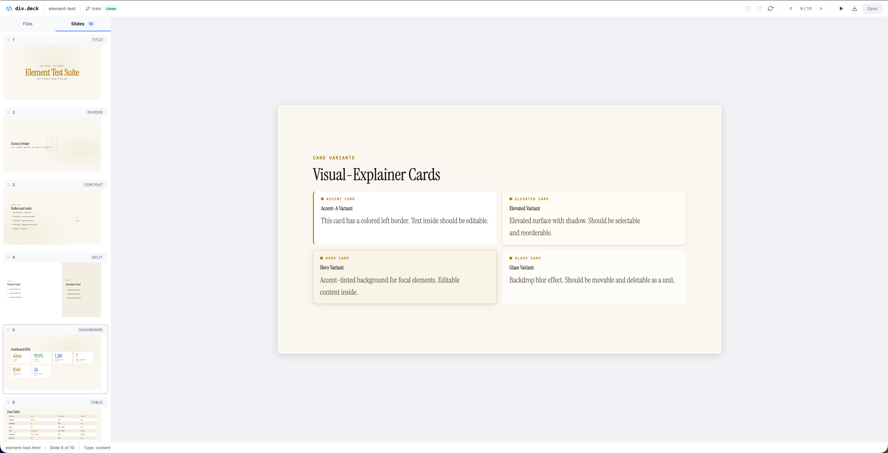
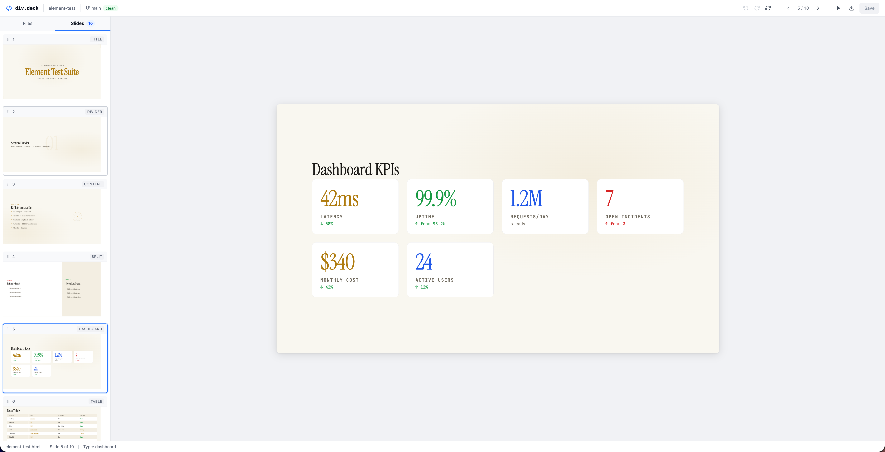

# div.deck

Browser-based editor for HTML slide decks. Edit slides visually with click-to-select, inline text editing, drag-to-reorder, and full-screen presentation mode.

Built for editing slide decks generated by the [visual-explainer](https://github.com/nicobailon/visual-explainer) skill, but works with any HTML deck using the `<section class="slide">` structure.





## Quick Start

```bash
npx div-deck init
```

This walks you through setup:

1. **Picks your presentations folder** — where your `.html` slide decks live (default: `./presentations`)
2. **Adds an npm script** — so you can run `npm run deck` to launch the editor
3. **Installs a Claude Code slash command** — type `/presentations` in Claude Code to start editing

Once set up, launch the editor with any of:

```bash
npm run deck              # npm script added by init
npx div-deck ./slides     # run directly with a directory
/presentations            # Claude Code slash command
```

The `/presentations` slash command launches the editor in the background and opens your browser — handy when you're generating decks with [visual-explainer](https://github.com/nicobailon/visual-explainer) and want to preview or tweak them.

## What It Does

- **File browser** — list, open, and delete `.html` slide decks
- **Visual editing** — click any element to select it, click again to edit text inline
- **Drag to reorder** — reorder slides in the sidebar or elements within a slide
- **Undo/redo** — full history with Cmd+Z / Cmd+Shift+Z
- **Presentation mode** — full-screen slideshow with keyboard navigation
- **Export PDF** — export to PDF via the browser's print dialog (Cmd+P)
- **Git status** — shows current branch and file status in the toolbar
- **Auto-save friendly** — saves preserve your editing state (active tab, open file)

## Keyboard Shortcuts

| Shortcut          | Action                            |
| ----------------- | --------------------------------- |
| Cmd+S             | Save                              |
| Cmd+Z             | Undo                              |
| Cmd+Shift+Z       | Redo                              |
| Cmd+P             | Export PDF                        |
| Left/Right arrows | Navigate slides                   |
| Delete/Backspace  | Delete selected element           |
| Escape            | Deselect / Exit presentation mode |

## Options

```
div-deck [directory]          Start the editor (default: ./presentations)
div-deck init                 Interactive project setup
div-deck --port 8080 ./slides Use a custom port (default: 3001)
div-deck --help               Show help
```

## How It Works

div.deck runs a single local server that serves both the editor UI and a file API. Slides render in iframes for perfect style isolation — your deck's CSS never leaks into the editor and vice versa.

The editor never modifies your HTML structure. It parses the deck, lets you edit visually, and serializes back to clean HTML.

## License

MIT
